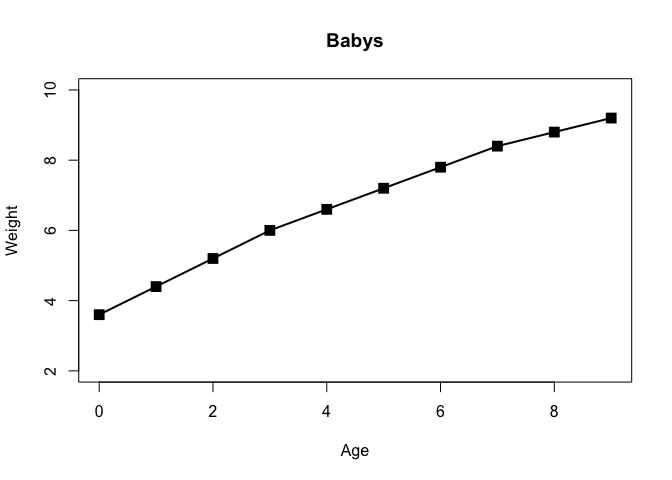
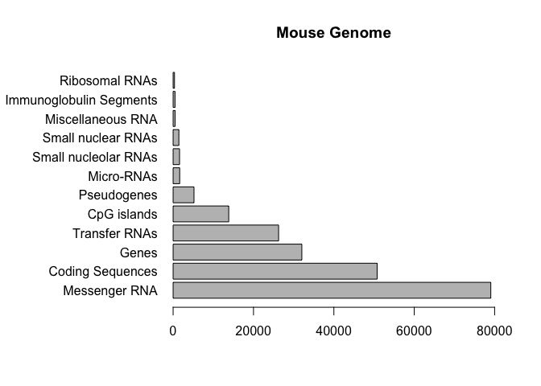
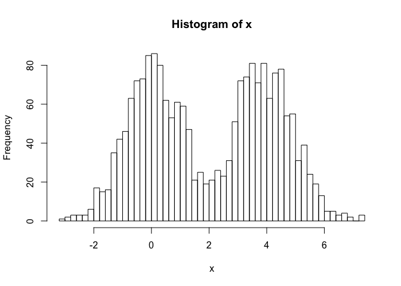
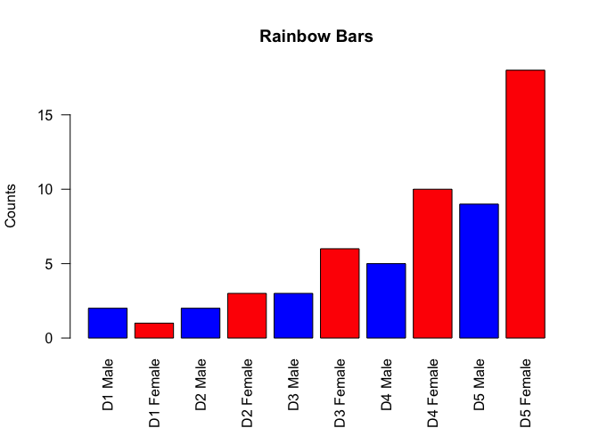
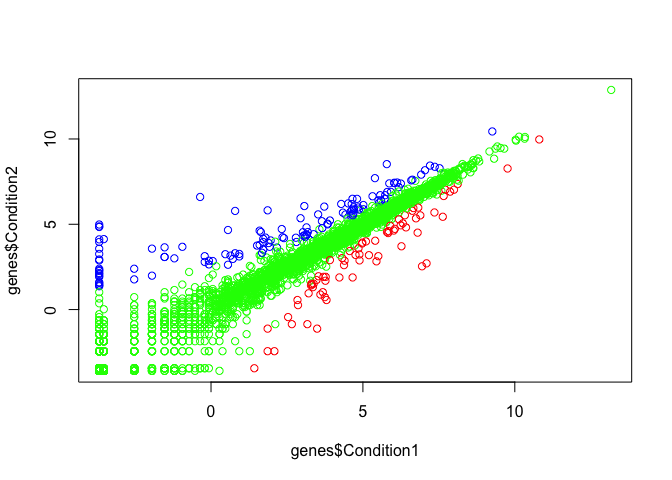
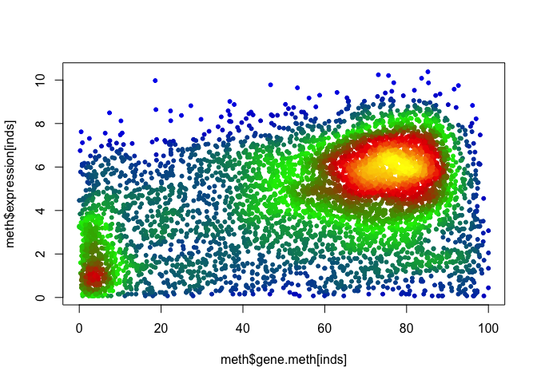

Lecture 5 Graphics and plots with R
================
Simon Midvtedt
Jan 23rd, 2019

### **Section 2A: line plot**

``` r
weight = read.table("bimm143_05_rstats/weight_chart.txt", header=TRUE)
plot(weight, pch=15, cex=1.5, lwd=2, type="o", ylim=c(2,10), 
     xlab="Age", ylab="Weight", main="Babys")
```



### **Section 2B: bar plot**

``` r
features = read.table("bimm143_05_rstats/feature_counts.txt", sep = "\t", header = TRUE)
par(mar = c(5.1, 11.2, 4.1, 3))
barplot(features$Count, horiz=T, names.arg = features$Feature, main = "Mouse Genome",
        las=1, xlim = c(0,80000))
```



### **Section 2C: histograms**

``` r
x = c(rnorm(1000, 0), rnorm(1000, 4))
par(mar = c(5.1, 4.1, 4.1, 2.1))
hist(x, breaks = 50)
```



### **Section 3A: colors**

``` r
rain = read.table("bimm143_05_rstats/male_female_counts.txt", header = T, sep = "\t")
barplot(rain$Count, names.arg = rain$Sample, main = "Rainbow Bars",
        col = c("blue", "red"), las = 2, ylab = "Counts")
```



### **Section 3B: coloring by value**

``` r
genes = read.table("bimm143_05_rstats/up_down_expression.txt", header = T, sep = "\t")
palette(c("red", "green", "blue"))
plot(genes$Condition1, genes$Condition2, col = genes$State)
```



### **Section 3C: dynamic colors**

``` r
meth = read.table("bimm143_05_rstats/expression_methylation.txt", header = T, sep = "\t")
inds <- meth$expression > 0
dcols <- densCols(meth$gene.meth[inds], meth$expression[inds])
dcols.c <- densCols(meth$gene.meth[inds], meth$expression[inds], 
                  colramp = colorRampPalette(c("blue2","green2","red2", "yellow")))
#plot(meth$gene.meth, meth$expression, pch=20, col = dcols.c)
plot(meth$gene.meth[inds], meth$expression[inds], pch=20, col = dcols.c)
```


