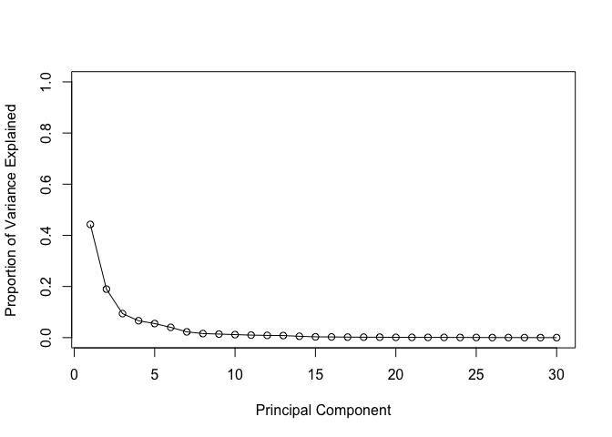
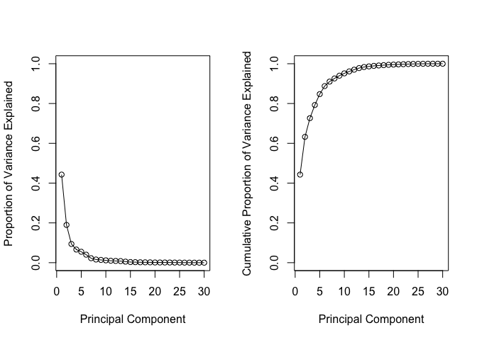

Unsupervised Learning Analysis of Human Breast Cancer Cells
================
Simon Midtvedt
2/8/2019

1. Preparing the Data
---------------------

``` r
# Save your input data file to a new 'data' directory
fna.data <- "data/WisconsinCancer.csv"

# Complete the following code to input the data and store as wisc.df
wisc.df <- read.csv(fna.data)

# Convert the features of the data: wisc.data
wisc.data <- as.matrix(wisc.df[,3:32])

# Set the row names of wisc.data
row.names(wisc.data) <- wisc.df$id
#head(wisc.data)

# Create diagnosis vector by completing the missing code
diagnosis <- as.numeric(wisc.df[,2]=="M")
```

### Q1. How many observations are in this dataset

``` r
dim(wisc.data)
```

    ## [1] 569  30

### Q2. How many variables/features in the data are suffixed with \_mean?

``` r
length(grep("mean",colnames(wisc.data)))
```

    ## [1] 10

### Q3. How many of the observations have a malignant diagnosis?

``` r
sum(diagnosis)
```

    ## [1] 212

2. Principal Component Analysis
-------------------------------

``` r
# Check column means and standard deviations
#colMeans(wisc.data)  
#apply(wisc.data,2,sd)

# Perform PCA on wisc.data by completing the following code
wisc.pr <- prcomp(scale(wisc.data))

# Look at summary of results
summary(wisc.pr)
```

    ## Importance of components:
    ##                           PC1    PC2     PC3     PC4     PC5     PC6
    ## Standard deviation     3.6444 2.3857 1.67867 1.40735 1.28403 1.09880
    ## Proportion of Variance 0.4427 0.1897 0.09393 0.06602 0.05496 0.04025
    ## Cumulative Proportion  0.4427 0.6324 0.72636 0.79239 0.84734 0.88759
    ##                            PC7     PC8    PC9    PC10   PC11    PC12
    ## Standard deviation     0.82172 0.69037 0.6457 0.59219 0.5421 0.51104
    ## Proportion of Variance 0.02251 0.01589 0.0139 0.01169 0.0098 0.00871
    ## Cumulative Proportion  0.91010 0.92598 0.9399 0.95157 0.9614 0.97007
    ##                           PC13    PC14    PC15    PC16    PC17    PC18
    ## Standard deviation     0.49128 0.39624 0.30681 0.28260 0.24372 0.22939
    ## Proportion of Variance 0.00805 0.00523 0.00314 0.00266 0.00198 0.00175
    ## Cumulative Proportion  0.97812 0.98335 0.98649 0.98915 0.99113 0.99288
    ##                           PC19    PC20   PC21    PC22    PC23   PC24
    ## Standard deviation     0.22244 0.17652 0.1731 0.16565 0.15602 0.1344
    ## Proportion of Variance 0.00165 0.00104 0.0010 0.00091 0.00081 0.0006
    ## Cumulative Proportion  0.99453 0.99557 0.9966 0.99749 0.99830 0.9989
    ##                           PC25    PC26    PC27    PC28    PC29    PC30
    ## Standard deviation     0.12442 0.09043 0.08307 0.03987 0.02736 0.01153
    ## Proportion of Variance 0.00052 0.00027 0.00023 0.00005 0.00002 0.00000
    ## Cumulative Proportion  0.99942 0.99969 0.99992 0.99997 1.00000 1.00000

### Q4. From your results, what proportion of the original variance is captured by the first principal components (PC1)?

-   44.3%

### Q5. How many principal components (PCs) are required to describe at least 70% of the original variance in the data?

-   3

### Q6. How many principal components (PCs) are required to describe at least 90% of the original variance in the data?

-   7

``` r
biplot(wisc.pr)
```


### Q7. What stands out to you about this plot? Is it easy or difficult to understand? Why?

-   Hard to understand. Too much information and annotations.

``` r
# Scatter plot observations by components 1 and 2
plot(wisc.pr$x[,c(1,2)], col = (diagnosis+1), 
     xlab = "PC1", ylab = "PC2")
```


### Q8. Generate a similar plot for principal components 1 and 3. What do you notice about these plots?

``` r
# Repeat for components 1 and 3
plot(wisc.pr$x[,c(1,3)], col = (diagnosis + 1), 
     xlab = "PC1", ylab = "PC3")
```

 - Cleaner cut separating the two subgroups in PC1 vs. PC2 than in PC1 vs. PC3.

``` r
# Calculate variance of each component
pr.var <- wisc.pr$sdev^2
head(pr.var)
```

    ## [1] 13.281608  5.691355  2.817949  1.980640  1.648731  1.207357

``` r
# Variance explained by each principal component: pve
pve <- pr.var / sum(pr.var)

# Plot variance explained for each principal component
plot(pve, xlab = "Principal Component", 
     ylab = "Proportion of Variance Explained", 
     ylim = c(0, 1), type = "o")
```



``` r
# Alternative scree plot of the same data, note data driven y-axis
barplot(pve, ylab = "Precent of Variance Explained",
     names.arg=paste0("PC",1:length(pve)), las=2, axes = FALSE)
axis(2, at=pve, labels=round(pve,2)*100 )
```


``` r
par(mfcol=c(1,2))
# Plot variance explained for each principal component
plot(pve, xlab = "Principal Component", 
     ylab = "Proportion of Variance Explained", 
     ylim = c(0, 1), type = "o")

# Plot cumulative proportion of variance explained
plot(cumsum(pve), xlab = "Principal Component", 
     ylab = "Cumulative Proportion of Variance Explained", 
     ylim = c(0, 1), type = "o")
```



``` r
## ggplot based graph
#install.packages("factoextra")
#library(factoextra)
```

### Q9. For the first principal component, what is the component of the loading vector (i.e. wisc.pr$rotation\[,1\]) for the feature concave.points\_mean?

``` r
wisc.pr$rotation[,1]
```

    ##             radius_mean            texture_mean          perimeter_mean 
    ##             -0.21890244             -0.10372458             -0.22753729 
    ##               area_mean         smoothness_mean        compactness_mean 
    ##             -0.22099499             -0.14258969             -0.23928535 
    ##          concavity_mean     concave.points_mean           symmetry_mean 
    ##             -0.25840048             -0.26085376             -0.13816696 
    ##  fractal_dimension_mean               radius_se              texture_se 
    ##             -0.06436335             -0.20597878             -0.01742803 
    ##            perimeter_se                 area_se           smoothness_se 
    ##             -0.21132592             -0.20286964             -0.01453145 
    ##          compactness_se            concavity_se       concave.points_se 
    ##             -0.17039345             -0.15358979             -0.18341740 
    ##             symmetry_se    fractal_dimension_se            radius_worst 
    ##             -0.04249842             -0.10256832             -0.22799663 
    ##           texture_worst         perimeter_worst              area_worst 
    ##             -0.10446933             -0.23663968             -0.22487053 
    ##        smoothness_worst       compactness_worst         concavity_worst 
    ##             -0.12795256             -0.21009588             -0.22876753 
    ##    concave.points_worst          symmetry_worst fractal_dimension_worst 
    ##             -0.25088597             -0.12290456             -0.13178394

### Q10. What is the minimum number of principal components required to explain 80% of the variance of the data?

-   5

3. Hierarchical Clustering
--------------------------

``` r
# Scale the wisc.data data: data.scaled
data.scaled <- scale(wisc.data)

data.dist <- dist(data.scaled)

wisc.hclust <- hclust(data.dist, method = "complete")
```

### Q11. Using the plot() and abline() functions, what is the height at which the clustering model has 4 clusters?

``` r
plot(wisc.hclust)
abline(h=19, col="red", lty=2)
```


``` r
wisc.hclust.clusters <- cutree(wisc.hclust,k=4)
table(wisc.hclust.clusters, diagnosis)
```

    ##                     diagnosis
    ## wisc.hclust.clusters   0   1
    ##                    1  12 165
    ##                    2   2   5
    ##                    3 343  40
    ##                    4   0   2

### Q12. Can you find a better cluster vs diagnoses match with by cutting into a different number of clusters between 2 and 10?

``` r
table(cutree(wisc.hclust,k=5), diagnosis)
```

    ##    diagnosis
    ##       0   1
    ##   1  12 165
    ##   2   0   5
    ##   3 343  40
    ##   4   2   0
    ##   5   0   2

4. K-means clustering
---------------------

``` r
wisc.km <- kmeans(scale(wisc.data), centers=2, nstart=20)
table(wisc.km$cluster, diagnosis)
```

    ##    diagnosis
    ##       0   1
    ##   1  14 175
    ##   2 343  37

### Q13. How well does k-means separate the two diagnoses? How does it compare to your hclust results?

-   Pretty good, I would say better than hclust.

``` r
table(wisc.hclust.clusters, wisc.km$cluster)
```

    ##                     
    ## wisc.hclust.clusters   1   2
    ##                    1 160  17
    ##                    2   7   0
    ##                    3  20 363
    ##                    4   2   0

5. Combining Methods
--------------------

``` r
wisc.pr.hclust <- hclust(dist(wisc.pr$x[,1:7]), method= "ward.D2")
plot(wisc.pr.hclust)
```


``` r
grps <- cutree(wisc.pr.hclust, k=2)
table(grps)
```

    ## grps
    ##   1   2 
    ## 216 353

``` r
table(grps, diagnosis)
```

    ##     diagnosis
    ## grps   0   1
    ##    1  28 188
    ##    2 329  24

``` r
plot(wisc.pr$x[,1:2], col=grps)
```


``` r
plot(wisc.pr$x[,1:2], col=diagnosis+1)
```


``` r
#library(rgl)
#plot3d(wisc.pr$x[,1:3], xlab="PC 1", ylab="PC 2", zlab="PC 3", cex=1.5, size=1, type="s", col=diagnosis+1)
```
