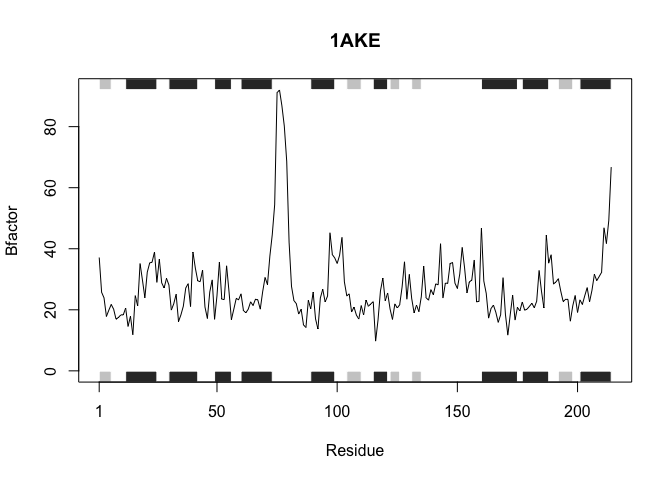

Lecture 6. Homework
================
Simon Midtvedt
Jan 25th, 2019

### Q6. How would you generalize the original code above to work with any set of input protein structures?

Function:

``` r
library(bio3d) # accessing the bio3d package

# Create the function with inputs: file (pdb structure file), chain (optional), elety (optional)
plotprot <- function(file, chain = "A", elety = "CA") { # chain and elety can be specified
  # Read the protein databank file:
  s <- read.pdb(file) 
  
  # Filter out the given chains and atoms in the pdb file using the trim function:
  s.chain <- trim.pdb(s, chain = chain, elety = elety) 
  
  # Select the [b] vector from the [atom] dataframe within the selected chain. 
  s.b <- s.chain$atom$b # the [b] vector or "Bfactor" represents isotropic displacement.
  
  # Plot s.b (Bfactor) towards residues and include secondary structure objects (sse):
  plotb3(s.b, sse=s.chain, typ="l", ylab="Bfactor", main=file) 
}
```

Running the function with different proteins:

``` r
plotprot("4AKE")
```

    ##   Note: Accessing on-line PDB file


``` r
plotprot("1AKE")  
```

    ##   Note: Accessing on-line PDB file
    ##    PDB has ALT records, taking A only, rm.alt=TRUE



``` r
plotprot("1E4Y") 
```

    ##   Note: Accessing on-line PDB file


