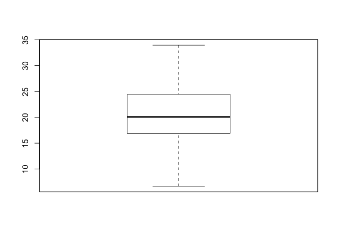
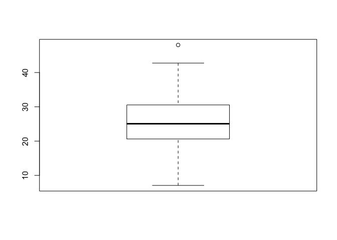

Lecture 13. Genome Informatics
================

### What percentage of MXL are G|G

``` r
mxl <- read.csv("373531-SampleGenotypes-Homo_sapiens_Variation_Sample_rs8067378.csv")
head(mxl)
```

    ##   Sample..Male.Female.Unknown. Genotype..forward.strand. Population.s.
    ## 1                  NA19648 (F)                       A|A ALL, AMR, MXL
    ## 2                  NA19649 (M)                       G|G ALL, AMR, MXL
    ## 3                  NA19651 (F)                       A|A ALL, AMR, MXL
    ## 4                  NA19652 (M)                       G|G ALL, AMR, MXL
    ## 5                  NA19654 (F)                       G|G ALL, AMR, MXL
    ## 6                  NA19655 (M)                       A|G ALL, AMR, MXL
    ##   Father Mother
    ## 1      -      -
    ## 2      -      -
    ## 3      -      -
    ## 4      -      -
    ## 5      -      -
    ## 6      -      -

``` r
table(mxl$Genotype..forward.strand.) / nrow(mxl)
```

    ## 
    ##      A|A      A|G      G|A      G|G 
    ## 0.343750 0.328125 0.187500 0.140625

### FASTQ Quality scores

``` r
library(seqinr)
library(gtools)
```

``` r
chars <- s2c("DDDDCDEDCDDDDBBDDDCC@")
phred <- asc(chars) - 33
```

### Populaion Scale Analysis

``` r
expr <- read.table("rs8067378_ENSG00000172057.6.txt")
table(expr$geno)
```

    ## 
    ## A/A A/G G/G 
    ## 108 233 121

``` r
gg <- expr$exp[expr$geno == "G/G"]
aa <- expr$exp[expr$geno == "A/A"]
ag <- expr$exp[expr$geno == "A/G"]
summary(gg)
```

    ##    Min. 1st Qu.  Median    Mean 3rd Qu.    Max. 
    ##   6.675  16.903  20.074  20.594  24.457  33.956

``` r
summary(aa)
```

    ##    Min. 1st Qu.  Median    Mean 3rd Qu.    Max. 
    ##   11.40   27.02   31.25   31.82   35.92   51.52

``` r
summary(ag)
```

    ##    Min. 1st Qu.  Median    Mean 3rd Qu.    Max. 
    ##   7.075  20.626  25.065  25.397  30.552  48.034

``` r
boxplot(gg)
```



``` r
boxplot(aa)
```


``` r
boxplot(ag)
```


