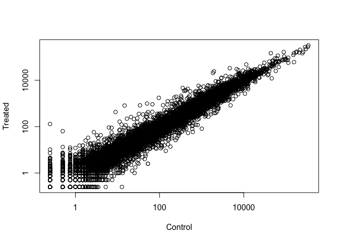

Transcriptomics and the analysis of RNA-Seq data
================

### Import countData and colData

``` r
counts <- read.csv("airway_scaledcounts.csv", stringsAsFactors = F)
metadata <- read.csv("airway_metadata.csv", stringsAsFactors = F)
```

How many genes are in this database?

``` r
nrow(counts)
```

    ## [1] 38694

How many experiments?

``` r
ncol(counts)
```

    ## [1] 9

Let's check for metadata to counts correspondence

``` r
all( metadata$id == colnames(counts)[-1] )
```

    ## [1] TRUE

Extract controls and calculate mean

``` r
# Find the column names (ids) of the 'control' experiments
control <- metadata[metadata$dex=="control",]

# Use the ids to extract the control counts columns
control.mean <- rowSums(counts[, control$id]) / nrow(control)
names(control.mean) <- counts$ensgene
```

Extract treated and calculate mean

``` r
treated <- metadata[metadata$dex=="treated",]
treated.mean <- rowSums(counts[, treated$id]) / nrow(treated)
names(treated.mean) <- counts$ensgene
```

Combine mean counts and check sums

``` r
meancounts <- data.frame(control.mean, treated.mean)
colSums(meancounts)
```

    ## control.mean treated.mean 
    ##     23005324     22196524

Plot mean counts

``` r
plot(control.mean, treated.mean, log="xy", xlab="Control", ylab="Treated")
```

    ## Warning in xy.coords(x, y, xlabel, ylabel, log): 15032 x values <= 0
    ## omitted from logarithmic plot

    ## Warning in xy.coords(x, y, xlabel, ylabel, log): 15281 y values <= 0
    ## omitted from logarithmic plot



Calculate log2 fold changes of the mean counts

``` r
meancounts$log2fc <- log2( meancounts$treated.mean / meancounts$control.mean )
```

Filter out weird values

``` r
zero.vals <- which(meancounts[,1:2] == 0, arr.ind = T)

to.rm <- unique(zero.vals[,1])
mycounts <- meancounts[-to.rm,]
```

Check for + - 2 threshold

``` r
up.ind <- mycounts$log2fc > 2
down.ind <- mycounts$log2fc < (-2)

sum(up.ind)
```

    ## [1] 250

``` r
sum(down.ind)
```

    ## [1] 367

Import annotations

``` r
anno <- read.csv("annotables_grch38.csv")
```

Merge annotations with my counts

``` r
anno.mycounts <- merge(mycounts, anno, by.x = "row.names", by.y = "ensgene")
```

``` r
# biocLite("AnnotationDbi")
# biocLite("org.Hs.eg.db")
library("AnnotationDbi")
```

    ## Loading required package: stats4

    ## Loading required package: BiocGenerics

    ## Loading required package: parallel

    ## 
    ## Attaching package: 'BiocGenerics'

    ## The following objects are masked from 'package:parallel':
    ## 
    ##     clusterApply, clusterApplyLB, clusterCall, clusterEvalQ,
    ##     clusterExport, clusterMap, parApply, parCapply, parLapply,
    ##     parLapplyLB, parRapply, parSapply, parSapplyLB

    ## The following objects are masked from 'package:stats':
    ## 
    ##     IQR, mad, sd, var, xtabs

    ## The following objects are masked from 'package:base':
    ## 
    ##     anyDuplicated, append, as.data.frame, basename, cbind,
    ##     colMeans, colnames, colSums, dirname, do.call, duplicated,
    ##     eval, evalq, Filter, Find, get, grep, grepl, intersect,
    ##     is.unsorted, lapply, lengths, Map, mapply, match, mget, order,
    ##     paste, pmax, pmax.int, pmin, pmin.int, Position, rank, rbind,
    ##     Reduce, rowMeans, rownames, rowSums, sapply, setdiff, sort,
    ##     table, tapply, union, unique, unsplit, which, which.max,
    ##     which.min

    ## Loading required package: Biobase

    ## Welcome to Bioconductor
    ## 
    ##     Vignettes contain introductory material; view with
    ##     'browseVignettes()'. To cite Bioconductor, see
    ##     'citation("Biobase")', and for packages 'citation("pkgname")'.

    ## 
    ## Attaching package: 'Biobase'

    ## The following object is masked from 'package:BiocGenerics':
    ## 
    ##     dims

    ## Loading required package: IRanges

    ## Loading required package: S4Vectors

    ## 
    ## Attaching package: 'S4Vectors'

    ## The following object is masked from 'package:base':
    ## 
    ##     expand.grid

    ## Warning: replacing previous import 'BiocGenerics::dims' by 'Biobase::dims'
    ## when loading 'AnnotationDbi'

``` r
library("org.Hs.eg.db")
```

    ## 

``` r
columns(org.Hs.eg.db)
```

    ##  [1] "ACCNUM"       "ALIAS"        "ENSEMBL"      "ENSEMBLPROT" 
    ##  [5] "ENSEMBLTRANS" "ENTREZID"     "ENZYME"       "EVIDENCE"    
    ##  [9] "EVIDENCEALL"  "GENENAME"     "GO"           "GOALL"       
    ## [13] "IPI"          "MAP"          "OMIM"         "ONTOLOGY"    
    ## [17] "ONTOLOGYALL"  "PATH"         "PFAM"         "PMID"        
    ## [21] "PROSITE"      "REFSEQ"       "SYMBOL"       "UCSCKG"      
    ## [25] "UNIGENE"      "UNIPROT"

``` r
mycounts$symbol <- mapIds(org.Hs.eg.db, 
                          keys = row.names(mycounts),
                          column = "SYMBOL",
                          keytype = "ENSEMBL",
                          multiVals = "first")
```

    ## 'select()' returned 1:many mapping between keys and columns

``` r
mycounts$entrez <- mapIds(org.Hs.eg.db, 
                          keys = row.names(mycounts),
                          column = "ENTREZID",
                          keytype = "ENSEMBL",
                          multiVals = "first")
```

    ## 'select()' returned 1:many mapping between keys and columns

``` r
mycounts$uniprot <- mapIds(org.Hs.eg.db, 
                          keys = row.names(mycounts),
                          column = "UNIPROT",
                          keytype = "ENSEMBL",
                          multiVals = "first")
```

    ## 'select()' returned 1:many mapping between keys and columns

### DESeq 2 analysis

``` r
# source("http://bioconductor.org/biocLite.R")
# biocLite()

# biocLite("DESeq2")
library("DESeq2")
```

    ## Loading required package: GenomicRanges

    ## Loading required package: GenomeInfoDb

    ## Warning: no function found corresponding to methods exports from
    ## 'GenomicRanges' for: 'concatenateObjects'

    ## Loading required package: SummarizedExperiment

    ## Loading required package: DelayedArray

    ## Loading required package: matrixStats

    ## 
    ## Attaching package: 'matrixStats'

    ## The following objects are masked from 'package:Biobase':
    ## 
    ##     anyMissing, rowMedians

    ## Loading required package: BiocParallel

    ## 
    ## Attaching package: 'DelayedArray'

    ## The following objects are masked from 'package:matrixStats':
    ## 
    ##     colMaxs, colMins, colRanges, rowMaxs, rowMins, rowRanges

    ## The following objects are masked from 'package:base':
    ## 
    ##     aperm, apply

    ## Warning: replacing previous import 'BiocGenerics::dims' by 'Biobase::dims'
    ## when loading 'SummarizedExperiment'

    ## Warning: replacing previous import 'Biobase::dims' by 'BiocGenerics::dims'
    ## when loading 'DESeq2'

Build our DESeq dataset required for DESeq analysis

``` r
dds <- DESeqDataSetFromMatrix(countData = counts,
                              colData = metadata,
                              design = ~dex,
                              tidy = T)
```

    ## converting counts to integer mode

    ## Warning in DESeqDataSet(se, design = design, ignoreRank): some variables in
    ## design formula are characters, converting to factors

``` r
dds
```

    ## class: DESeqDataSet 
    ## dim: 38694 8 
    ## metadata(1): version
    ## assays(1): counts
    ## rownames(38694): ENSG00000000003 ENSG00000000005 ...
    ##   ENSG00000283120 ENSG00000283123
    ## rowData names(0):
    ## colnames(8): SRR1039508 SRR1039509 ... SRR1039520 SRR1039521
    ## colData names(4): id dex celltype geo_id

Run the DESeq analysis

``` r
dds <- DESeq(dds)
```

    ## estimating size factors

    ## estimating dispersions

    ## gene-wise dispersion estimates

    ## mean-dispersion relationship

    ## final dispersion estimates

    ## fitting model and testing

Get our results

``` r
res <- results(dds)
res
```

    ## log2 fold change (MLE): dex treated vs control 
    ## Wald test p-value: dex treated vs control 
    ## DataFrame with 38694 rows and 6 columns
    ##                          baseMean     log2FoldChange             lfcSE
    ##                         <numeric>          <numeric>         <numeric>
    ## ENSG00000000003  747.194195359907   -0.3507029622814 0.168242083226488
    ## ENSG00000000005                 0                 NA                NA
    ## ENSG00000000419  520.134160051965  0.206107283859631 0.101041504450297
    ## ENSG00000000457  322.664843927049 0.0245270113332259 0.145133863747848
    ## ENSG00000000460   87.682625164828 -0.147142630021601 0.256995442048617
    ## ...                           ...                ...               ...
    ## ENSG00000283115                 0                 NA                NA
    ## ENSG00000283116                 0                 NA                NA
    ## ENSG00000283119                 0                 NA                NA
    ## ENSG00000283120 0.974916032393564 -0.668250141507888  1.69441251902541
    ## ENSG00000283123                 0                 NA                NA
    ##                               stat             pvalue              padj
    ##                          <numeric>          <numeric>         <numeric>
    ## ENSG00000000003  -2.08451390731582 0.0371134465286876 0.163017154198658
    ## ENSG00000000005                 NA                 NA                NA
    ## ENSG00000000419   2.03982793982463 0.0413674659636722 0.175936611069872
    ## ENSG00000000457  0.168995785682647  0.865799956261551 0.961682459668587
    ## ENSG00000000460 -0.572549570718713  0.566949713033353 0.815805192485639
    ## ...                            ...                ...               ...
    ## ENSG00000283115                 NA                 NA                NA
    ## ENSG00000283116                 NA                 NA                NA
    ## ENSG00000283119                 NA                 NA                NA
    ## ENSG00000283120 -0.394384563383805  0.693297138830703                NA
    ## ENSG00000283123                 NA                 NA                NA

``` r
summary(res)
```

    ## 
    ## out of 25258 with nonzero total read count
    ## adjusted p-value < 0.1
    ## LFC > 0 (up)       : 1564, 6.2%
    ## LFC < 0 (down)     : 1188, 4.7%
    ## outliers [1]       : 142, 0.56%
    ## low counts [2]     : 9971, 39%
    ## (mean count < 10)
    ## [1] see 'cooksCutoff' argument of ?results
    ## [2] see 'independentFiltering' argument of ?results

Make volcano plot

``` r
mycols <- rep("gray", nrow(res))
mycols[abs(res$log2FoldChange) > 2] <-"red"
subset.inds <- res$padj < 0.01 & abs(res$log2FoldChange) > 2
mycols[subset.inds] <- "blue"
plot(res$log2FoldChange, -log(res$padj), col=mycols)
```


